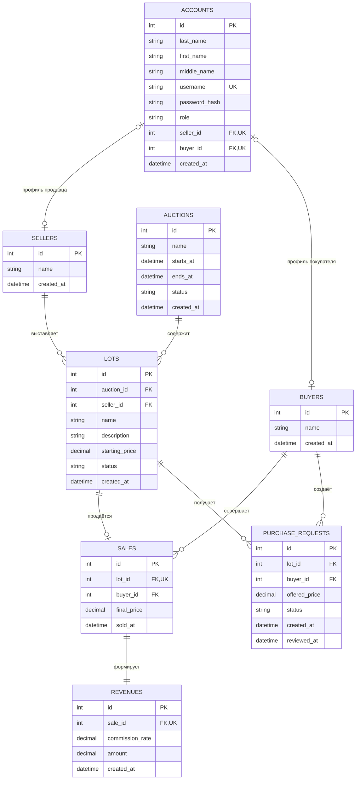

# Аукционы

Приложение для учёта аукционов с веб-интерфейсом и HTTP API. Покупатель отправляет заявку на лот, а администратор подтверждает или отклоняет её.

## Технологии

- Python от 3.12 (поддерживаются 3.12 и 3.13);
- FastAPI от 0.115 и Uvicorn от 0.34;
- PostgreSQL от 14;
- SQLAlchemy от 2.0, Alembic от 1.14 и psycopg от 3.2;
- Pydantic Settings от 2.7, itsdangerous от 2.2;
- httpx от 0.28, pytest от 8.3, pytest-cov от 6 и Ruff от 0.9 — для разработки;
- uv от 0.10.7 и GNU Make.

Ограничения версий библиотек и Python указаны в `pyproject.toml`; версии PostgreSQL и uv в проекте не закреплены. Указанные минимальные версии PostgreSQL и uv соответствуют используемому окружению.

## Подготовка окружения

Для запуска необходимы Python 3.12, uv, GNU Make и PostgreSQL. Команда `make setup` создаёт окружение именно с Python 3.12.

Установите зависимости проекта:

```bash
make setup
```

Создайте локальный файл с переменными окружения:

```bash
cp .env.example .env
```

Файл `.env` содержит локальные настройки и не должен попадать в Git.

Перед первым запуском создайте пользователя и базу PostgreSQL, соответствующие значениям из `.env`, затем примените миграции:

```bash
make migrate
```

## Запуск

Запустите приложение:

```bash
make run
```

После запуска доступны:

- веб-интерфейс: <http://127.0.0.1:8000>;
- API: <http://127.0.0.1:8000>;
- Swagger UI: <http://127.0.0.1:8000/docs>;
- проверка работоспособности: <http://127.0.0.1:8000/health>.

## HTTP API

| Метод  | Адрес                    | Назначение                             |
| ------ | ------------------------ | -------------------------------------- |
| `GET`  | `/health`                | Проверить работоспособность приложения |
| `POST` | `/sellers`               | Создать продавца                       |
| `GET`  | `/sellers`               | Получить список продавцов              |
| `GET`  | `/sellers/{seller_id}`   | Получить продавца                      |
| `POST` | `/buyers`                | Создать покупателя                     |
| `GET`  | `/buyers`                | Получить список покупателей            |
| `GET`  | `/buyers/{buyer_id}`     | Получить покупателя                    |
| `POST` | `/auctions`              | Создать аукцион                        |
| `GET`  | `/auctions`              | Получить список аукционов              |
| `GET`  | `/auctions/{auction_id}` | Получить аукцион                       |
| `POST` | `/lots`                  | Создать лот                            |
| `GET`  | `/lots`                  | Получить список лотов                  |
| `GET`  | `/lots/{lot_id}`         | Получить лот                           |
| `POST` | `/sales`                 | Зарегистрировать продажу лота          |
| `GET`  | `/sales`                 | Получить список продаж                 |
| `GET`  | `/sales/{sale_id}`       | Получить продажу                       |
| `GET`  | `/revenues`              | Получить список доходов                |
| `GET`  | `/revenues/{revenue_id}` | Получить доход                         |
| `POST` | `/web/buyer/purchase-requests` | Отправить заявку на покупку      |
| `POST` | `/web/admin/purchase-requests/{id}/approve` | Подтвердить продажу |
| `POST` | `/web/admin/purchase-requests/{id}/reject` | Отклонить заявку    |

Форматы запросов и ответов можно посмотреть и проверить через Swagger UI.

Маршруты `/sellers`, `/buyers`, `/auctions`, `/lots`, а также чтение `/sales` и `/revenues` сейчас не требуют входа. Создание продажи через `POST /sales` требует сессии администратора. Для веб-интерфейса используются отдельные маршруты `/auth/*` и `/web/*` с проверкой роли.

## Веб-интерфейс и роли

Откройте <http://127.0.0.1:8000>. При первом входе создаётся администратор с
логином и паролем из `ADMIN_USERNAME` и `ADMIN_PASSWORD` в `.env`. Перед
развёртыванием обязательно замените демонстрационные значения и `SESSION_SECRET`.

- Администратор создаёт учётную запись с ролью `admin` или `user`.
- Существующего пользователя с ролью `user` администратор регистрирует как
  продавца либо покупателя; ФИО переносится из учётной записи.
- Пользователь-продавец видит только свои лоты и может выставлять новые.
- Пользователь-покупатель видит доступные лоты, свои продажи и может оформить покупку.
- Покупатель отправляет заявку с предложенной ценой. До решения администратора она имеет статус `pending`; подтверждение создаёт продажу и доход, отклонение сохраняет заявку и оставляет лот доступным.
- Администратор видит учётные записи, участников, продажи и доходы; пользователь без профиля продавца или покупателя может просматривать список аукционов.

На маршрутах `/web/*` сервер проверяет сессию, роль и связь учётной записи с продавцом или покупателем. Веб-интерфейс состоит из страницы входа `/login` и кабинета `/app`; выход выполняется через `POST /auth/logout`.

Основные маршруты кабинета: `GET /auth/me`, `GET /web/auctions`, `/web/lots`, `/web/sales`, `/web/purchase-requests`; администратору также доступны `GET /web/revenues`, `/web/admin/accounts`, `/web/admin/sellers`, `/web/admin/buyers`, создание учётных записей, участников и аукционов, подтверждение и отклонение заявок. Продавец создаёт лот через `POST /web/seller/lots`.

API использует следующие основные коды ответа:

- `200 OK` — запрос успешно выполнен;
- `201 Created` — сущность создана;
- `400 Bad Request` — запрос нарушает бизнес-правило;
- `404 Not Found` — сущность не найдена;
- `409 Conflict` — данные конфликтуют с существующей записью;
- `422 Unprocessable Entity` — запрос не прошёл проверку.

## Правила регистрации продажи

- покупатель создаёт заявку, но это ещё не считается продажей;
- продажа и доход создаются только после подтверждения заявки администратором;
- отклонённая заявка сохраняется в истории, а лот остаётся доступным;
- лот и покупатель должны существовать;
- один лот можно продать только один раз;
- итоговая цена не может быть ниже начальной цены лота;
- продажа, доход организатора и статус лота сохраняются одной транзакцией;
- доход рассчитывается по `COMMISSION_RATE` и округляется до копеек.

## Команды проекта

| Команда        | Назначение                                                  |
| -------------- | ----------------------------------------------------------- |
| `make setup`   | Установить зависимости и подготовить виртуальное окружение  |
| `make run`     | Запустить HTTP API локально                                 |
| `make migrate` | Применить миграции базы данных                              |
| `make test`    | Запустить автоматические тесты                              |
| `make quality` | Проверить форматирование и выполнить статический анализ     |
| `make format`  | Отформатировать код и применить безопасные исправления Ruff |
| `make verify`  | Выполнить все обязательные локальные проверки               |

Для выполнения интеграционных тестов PostgreSQL должен быть запущен, а миграции должны быть применены.

## Конфигурация

| Переменная        | Назначение                               |
| ----------------- | ---------------------------------------- |
| `DATABASE_URL`    | Строка подключения к PostgreSQL          |
| `APP_HOST`        | Адрес, на котором запускается приложение |
| `APP_PORT`        | Порт приложения                          |
| `LOG_LEVEL`       | Уровень журналирования                   |
| `COMMISSION_RATE` | Процент комиссии организатора            |
| `SESSION_SECRET`  | Секрет подписи cookie сессии             |
| `ADMIN_LAST_NAME` | Фамилия первого администратора           |
| `ADMIN_FIRST_NAME` | Имя первого администратора              |
| `ADMIN_MIDDLE_NAME` | Отчество первого администратора         |
| `ADMIN_USERNAME` | Логин первого администратора             |
| `ADMIN_PASSWORD` | Пароль первого администратора            |

Пример конфигурации находится в `.env.example`. Перед развёртыванием замените демонстрационные пароль администратора и `SESSION_SECRET`. `LOG_LEVEL` считывается из окружения, но отдельная настройка журналирования по нему в приложении пока не выполняется. `GET /health` проверяет ответ приложения, а не соединение с базой данных.

## Схема данных



Обозначения: `PK` — первичный ключ, `FK` — внешний ключ, `UK` — уникальное значение.

## Правила внесения изменений

- каждое изменение выполняется в отдельной ветке, созданной от актуальной `main`;
- функциональное изменение должно быть связано с Issue и добавлено через Pull Request;
- перед созданием Pull Request необходимо выполнить `make verify`;
- при изменении структуры базы данных необходимо создать миграцию и проверить её командой `make migrate`;
- Pull Request можно объединять только после успешных проверок, просмотра изменений и выполнения критериев задачи;
- запрещено напрямую вносить изменения в `main`, добавлять секреты и локальный файл `.env`;
- запрещено удалять тесты, отключать анализаторы или ослаблять проверки ради успешного результата;
- изменения в `pyproject.toml`, `uv.lock`, `Makefile`, миграциях, `.gitignore` и `.env.example` требуют отдельной внимательной проверки;
- изменение считается готовым, когда код, тесты и документация согласованы, а обязательные проверки проходят успешно.

## Документация

Подробное назначение системы, пользовательские сценарии, модель данных, связи и основные ограничения приведены в [техническом задании](docs/technical-specification.md).
