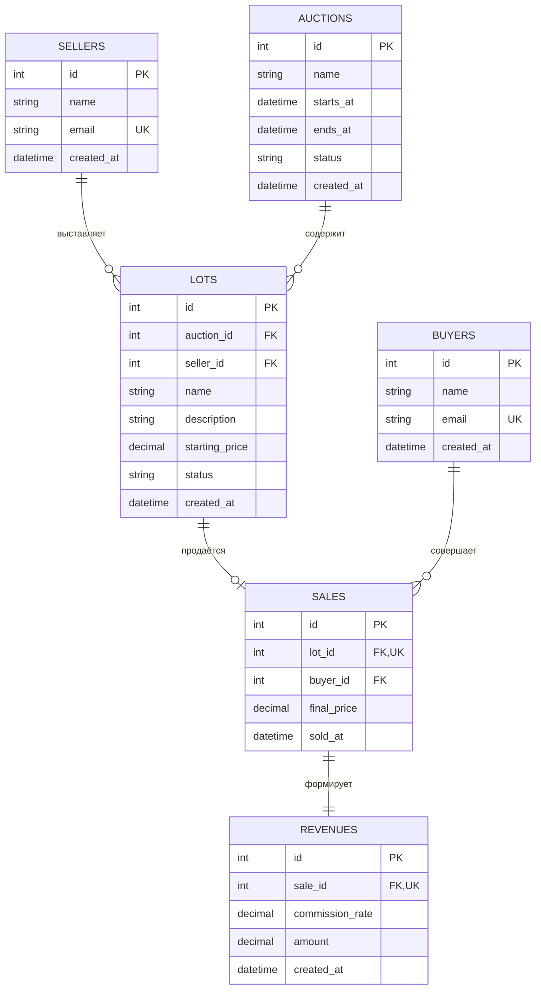

# Аукционы

HTTP API для учёта аукционов, лотов, продавцов, покупателей, продаж и доходов организатора.

## Технологии

- Python 3.12;
- FastAPI;
- PostgreSQL;
- SQLAlchemy;
- Alembic;
- pytest;
- Ruff;
- uv.

## Подготовка окружения

Для запуска необходимы Python 3.12, uv, GNU Make и PostgreSQL.

Установите зависимости проекта:

```bash
make setup
```

Создайте локальный файл с переменными окружения:

```bash
cp .env.example .env
```

Файл `.env` содержит локальные настройки и не должен попадать в Git.

Перед первым запуском создайте пользователя и базу PostgreSQL, соответствующие значениям из `.env`, затем примените миграции:

```bash
make migrate
```

## Запуск

Запустите приложение:

```bash
make run
```

После запуска доступны:

- API: <http://127.0.0.1:8000>;
- Swagger UI: <http://127.0.0.1:8000/docs>;
- проверка работоспособности: <http://127.0.0.1:8000/health>.

## HTTP API

| Метод  | Адрес                    | Назначение                             |
| ------ | ------------------------ | -------------------------------------- |
| `GET`  | `/health`                | Проверить работоспособность приложения |
| `POST` | `/sellers`               | Создать продавца                       |
| `GET`  | `/sellers`               | Получить список продавцов              |
| `GET`  | `/sellers/{seller_id}`   | Получить продавца                      |
| `POST` | `/buyers`                | Создать покупателя                     |
| `GET`  | `/buyers`                | Получить список покупателей            |
| `GET`  | `/buyers/{buyer_id}`     | Получить покупателя                    |
| `POST` | `/auctions`              | Создать аукцион                        |
| `GET`  | `/auctions`              | Получить список аукционов              |
| `GET`  | `/auctions/{auction_id}` | Получить аукцион                       |
| `POST` | `/lots`                  | Создать лот                            |
| `GET`  | `/lots`                  | Получить список лотов                  |
| `GET`  | `/lots/{lot_id}`         | Получить лот                           |
| `POST` | `/sales`                 | Зарегистрировать продажу лота          |
| `GET`  | `/sales`                 | Получить список продаж                 |
| `GET`  | `/sales/{sale_id}`       | Получить продажу                       |
| `GET`  | `/revenues`              | Получить список доходов                |
| `GET`  | `/revenues/{revenue_id}` | Получить доход                         |

Форматы запросов и ответов можно посмотреть и проверить через Swagger UI.

API использует следующие основные коды ответа:

- `200 OK` — запрос успешно выполнен;
- `201 Created` — сущность создана;
- `400 Bad Request` — запрос нарушает бизнес-правило;
- `404 Not Found` — сущность не найдена;
- `409 Conflict` — данные конфликтуют с существующей записью;
- `422 Unprocessable Entity` — запрос не прошёл проверку.

## Правила регистрации продажи

- лот и покупатель должны существовать;
- один лот можно продать только один раз;
- итоговая цена не может быть ниже начальной цены лота;
- продажа, доход организатора и статус лота сохраняются одной транзакцией;
- доход рассчитывается по `COMMISSION_RATE` и округляется до копеек.

## Команды проекта

| Команда        | Назначение                                                  |
| -------------- | ----------------------------------------------------------- |
| `make setup`   | Установить зависимости и подготовить виртуальное окружение  |
| `make run`     | Запустить HTTP API локально                                 |
| `make migrate` | Применить миграции базы данных                              |
| `make test`    | Запустить автоматические тесты                              |
| `make quality` | Проверить форматирование и выполнить статический анализ     |
| `make format`  | Отформатировать код и применить безопасные исправления Ruff |
| `make verify`  | Выполнить все обязательные локальные проверки               |

Для выполнения интеграционных тестов PostgreSQL должен быть запущен, а миграции должны быть применены.

## Конфигурация

| Переменная        | Назначение                               |
| ----------------- | ---------------------------------------- |
| `DATABASE_URL`    | Строка подключения к PostgreSQL          |
| `APP_HOST`        | Адрес, на котором запускается приложение |
| `APP_PORT`        | Порт приложения                          |
| `LOG_LEVEL`       | Уровень журналирования                   |
| `COMMISSION_RATE` | Процент комиссии организатора            |

Пример безопасной конфигурации находится в файле `.env.example`.

## Схема данных



Обозначения: `PK` — первичный ключ, `FK` — внешний ключ, `UK` — уникальное значение.

## Правила внесения изменений

- каждое изменение выполняется в отдельной ветке, созданной от актуальной `main`;
- функциональное изменение должно быть связано с Issue и добавлено через Pull Request;
- перед созданием Pull Request необходимо выполнить `make verify`;
- при изменении структуры базы данных необходимо создать миграцию и проверить её командой `make migrate`;
- Pull Request можно объединять только после успешных проверок, просмотра изменений и выполнения критериев задачи;
- запрещено напрямую вносить изменения в `main`, добавлять секреты и локальный файл `.env`;
- запрещено удалять тесты, отключать анализаторы или ослаблять проверки ради успешного результата;
- изменения в `pyproject.toml`, `uv.lock`, `Makefile`, миграциях, `.gitignore` и `.env.example` требуют отдельной внимательной проверки;
- изменение считается готовым, когда код, тесты и документация согласованы, а обязательные проверки проходят успешно.

## Документация

Подробное назначение системы, пользовательские сценарии, модель данных, связи и основные ограничения приведены в [техническом задании](docs/technical-specification.md).
